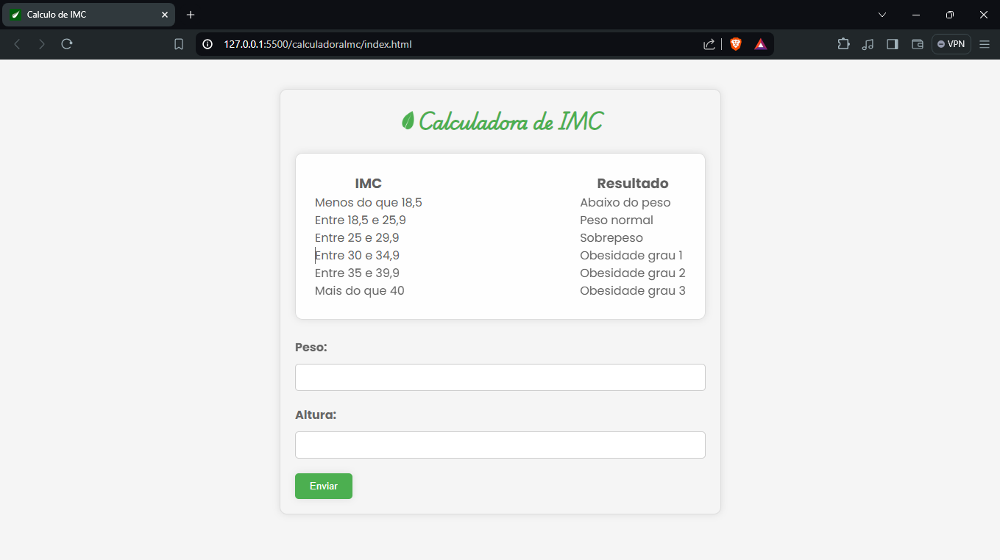

# Calculadora de IMC

Uma simples calculadora de Índice de Massa Corporal (IMC) feita em HTML, CSS e JavaScript.

## Funcionalidades

- Calcula o IMC com base no peso e altura fornecidos pelo usuário.
- Exibe uma mensagem com o resultado do IMC e a classificação correspondente.

## Como usar

Basta preencher os campos de peso e altura no formulário e clicar em "Enviar". O resultado do IMC será exibido abaixo do formulário.